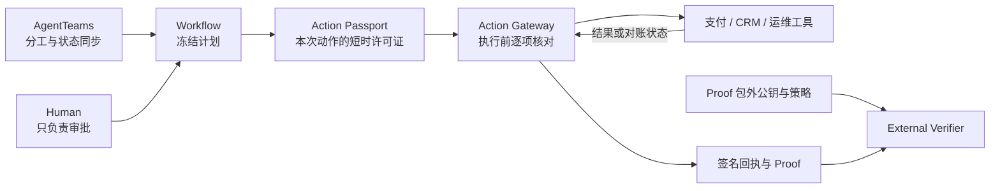

# ProofMesh｜智能体可信动作控制面

Agent 已经能查订单、改工单、发起退款、执行发布。企业真正犹豫的是最后一步：**当一次写操作超时、参数变化或需要审批时，系统怎么保证它不会多做一次、做错对象，或者在事后说不清发生了什么？**

ProofMesh 是放在 Agent 协作层与企业工具之间的动作控制面。AgentTeams 负责任务分工，ProofMesh 负责每一次有副作用的动作：先确定这次允许做什么，再执行；遇到不确定结果先对账；最后留下可以独立复核的证据。

[在线动作决策台](https://dingyucanada.github.io/ProofMesh/) · [10 分钟本地复现](#10-分钟本地复现) · [架构说明](docs/architecture.md) · [安全边界](SECURITY.md)

## 为什么企业需要这一层

常见的 Agent 工具链已经能回答“这个角色能不能调用退款接口”。它通常回答不了更细的四个问题：

- 这一次调用允许处理哪个租户、哪笔业务对象和哪些参数？
- 人工审批批准的是原计划，还是审批后被替换过的计划？
- 上游已经执行但响应丢失时，能否安全重试？
- 审计者能否在不信任执行方的情况下，复核审批、回执和最终业务状态？

退款只是其中一个例子。同样的问题也会出现在生产发布、配置变更、理赔付款、授信调整和批量消息发送中。它们的共同点不是行业，而是都会改变真实业务状态。

## ProofMesh 怎么处理一次动作



一次写操作会经过四道约束：

1. **Action Passport** 绑定主体、租户、工具、业务对象、参数摘要、策略、审批、调用次数和有效期。
2. **Action Gateway** 在真正调用工具之前逐项匹配。任何工具、参数或上下文漂移都会被拒绝。
3. **reconcile-before-retry** 在超时或崩溃后先查询上游结果。确认未执行才重派；无法确认就进入 `UNKNOWN_MANUAL`。
4. **External Verifier** 使用 Proof 包外的信任材料，重新核对审批、任务回执、工具回执和业务终态。

这套约束位于执行路径上，不依赖模型“记住规则”。模型、Prompt 或业务适配器可以替换，写操作仍要经过同一套合同。

## 两个参考场景

### 客服退款

支付渠道已经完成退款，CRM 关单却返回失败。系统不能从一个报错推断“退款没有发生”。ProofMesh 会用稳定的 operation id 查询支付终态，再决定完成、补偿或转人工，避免重复退款。

### 生产运维变更

发布、配置和回滚同样使用 `AuthorizedToolCaller → Action Passport → Action Gateway → signed Receipt → External Verifier`。仓库包含低风险完成、高风险审批、健康门失败后恢复和无法判定时停止四条参考路径。

两套场景共用同一协议，业务工具和策略可以替换。它们都是确定性参考环境，不代表客户生产系统已经接入。

## 已经验证到哪一步

| 问题 | 当前结果 | 证据边界 |
|---|---:|---|
| 错工具、错参数、错上下文会不会穿过网关 | 0 次错误通过 | AgentDojo 629 组授权合同回放，不是模型 ASR |
| 故障恢复会不会产生重复副作用 | 0 / 240 | 独立进程 HTTP 合成故障，不是客户工单 |
| 可判定的故障能否完成或补偿 | 180 / 180 | 合成沙箱中的四类故障 |
| 上游结果无法判定时是否停止自动重派 | 60 / 60 | 全部进入 `UNKNOWN_MANUAL` |
| AgentTeams 控制面是否真实运行 | Team Active；7/7 Worker Running；direct MCP 7/7 | `modelDriven=false`，尚未证明模型自主协作 |
| 公开客服文本能否安全分流 | Banking77 accuracy 81.79%，退款 recall 85% | 结论为 `NOT_PRODUCTION_READY` |
| CFPB 公开投诉能否无原文落盘地处理 | 240 / 240 | 只做无写操作 shadow，不报告准确率 |

当前测试集为 **164 passed**。生产身份、托管密钥、真实供应商账户、客户授权数据与生产 SLA 尚未接入。

## AgentTeams、Skill、MCP 与 RAG

项目以 AgentTeams 为协作基点。已验证基线为 `v1.2.0-beta.1`、commit `78d0ceda336befa6e62bf89fc1a6b08b965e128d`；当前 stable `v1.2.2` 是迁移目标，尚未在 ProofMesh 上验证。

- **AgentTeams**：1 个 Leader 拆解任务，6 个 Worker 分别处理接入、上下文、策略、执行、验证和记忆；Human 单独审批。
- **7 个 Skill**：每个角色都有闭合的输入、输出、权限和失败合同。
- **TeamHarness MCP**：管理 Project / Task 协同与状态传递。
- **ProofMesh role MCP**：只暴露各角色需要的业务窄口。
- **Action Gateway**：所有高风险副作用的唯一执行入口。
- **RAG**：当前不使用。上下文由共享 CAS 状态、脱敏终态记忆和 trace / receipt 可观测性提供。

完整映射见 [AgentTeams 官方能力映射](docs/agentteams-official-mapping.md) 与 [Agent Identity 清单](docs/agent-identity-register.md)。

## 10 分钟本地复现

需要 Python 3.10+，推荐 Python 3.11：

```bash
python3.11 -m venv .venv
source .venv/bin/activate
pip install -e '.[dev]'
make clean-runtime
pytest -q
```

运行低风险完成路径与下游故障补偿路径：

```bash
PYTHONPATH=src python3 -m proofmesh.cli --home . demo-refund TKT-LOW-001
PYTHONPATH=src python3 -m proofmesh.cli --home . demo-refund TKT-SAGA-001
```

本地 FastAPI 控制台：

```bash
cp .env.example .env
# 将 replace-with-* 替换为不同的随机值
set -a
source .env
set +a
PROOFMESH_HOME=. PYTHONPATH=src uvicorn proofmesh.api:app \
  --host 127.0.0.1 --port 8000 --no-server-header
```

打开 `http://127.0.0.1:8000`。本地参考环境会实际改变隔离数据库，但不会连接真实支付、CRM 或生产系统。重复固定工单前请停止服务并运行 `make clean-runtime`。

## 公开 Demo

[GitHub Pages 动作决策台](https://dingyucanada.github.io/ProofMesh/)包含两部分：

- 浏览器中的确定性决策实验：可以调整业务场景、风险、审批、上游结果和合同篡改方式，观察 Gateway 的放行、拒绝、对账、补偿与 `UNKNOWN_MANUAL` 决策；
- 三条冻结 Proof 的证据回放：浏览器复核 SHA-256，并跳转到机器可读的验真报告。

它不接收凭证或客户数据，也不调用真实后端。这个设计让公开链接保持安全和可重复，同时不把前端模拟包装成线上生产运行。细节见 [公网演示边界](docs/public-demo-boundary.md)。

## 进一步复现

```bash
# 三条退款参考路径和包外验真
make reference-evidence

# 240 条独立进程合成故障实验
make synthetic-http-shadow

# AgentDojo 629 组授权合同回放
make validate-agentdojo
make replay-agentdojo

# Banking77 与 CFPB 公开数据评测
make banking77-routing
make cfpb-shadow
```

主要报告：

- [退款参考证据](artifacts/reference/manifest.json)
- [生产运维参考证据](artifacts/operations-reference/report.json)
- [授权合同回放](artifacts/public-benchmark/authorization-contract-replay.md)
- [合成故障实验](artifacts/synthetic-http-shadow/report.md)
- [公开数据评测](docs/public-dataset-benchmark.md)
- [试点指标设计](docs/pilot-value-scorecard.md)

## 安全与生产边界

生产参考接口包含 OIDC / JWKS、PostgreSQL GatewayStore、mTLS 远程签名、Kubernetes admission、SBOM 与 CI provenance。它们已经有代码和测试，但尚未连接企业 IdP、KMS、托管 PostgreSQL 或生产集群。

Stripe / HubSpot adapter 实现了 test-mode 合同、幂等与对账语义，当前只使用本地 HTTP 仿真器验证，没有使用真实测试账户。高风险人工审批需要外部签名 JWS；参考 issuer 仅用于本地与冻结证据，不代表企业 MFA。

请勿把 `.env`、token、私钥、数据库、客户记录或真实 sandbox trace 提交到仓库。完整披露见 [SECURITY.md](SECURITY.md) 与 [部署说明](docs/deployment.md)。

## 开源与复用

核心代码、动作协议、7 个 Skill、Gateway 和 Verifier 采用 Apache-2.0。第三方基准数据不随 Apache 代码重许可；仓库只保留必要的锁文件、派生结果与来源说明。

如果要接入新的业务域，通常只需替换三类组件：

1. 业务工具适配器与 `reconcile` 逻辑；
2. 可签名、可固定摘要的策略；
3. 可独立读取的业务终态 attestation。

协议层继续负责身份、参数、审批、幂等、恢复和验真。

## Repository map

```text
src/proofmesh/        action protocol, workflow, gateway, verifier, adapters
agentteams/           Team / Worker manifests, packages, runtime evidence
skills/               seven reusable role Skills
artifacts/            frozen reference and benchmark reports
demo/                 interactive browser lab and evidence replay
docs/                 architecture, deployment, evaluation and boundaries
tests/                positive, negative, crash and tamper tests
```

## License

Apache-2.0。数据集、上游项目与云产品的许可和归属分别记录在对应目录与 [NOTICE](NOTICE)。
