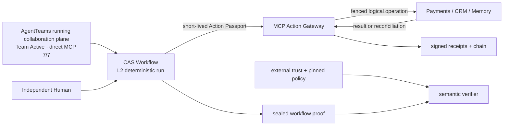
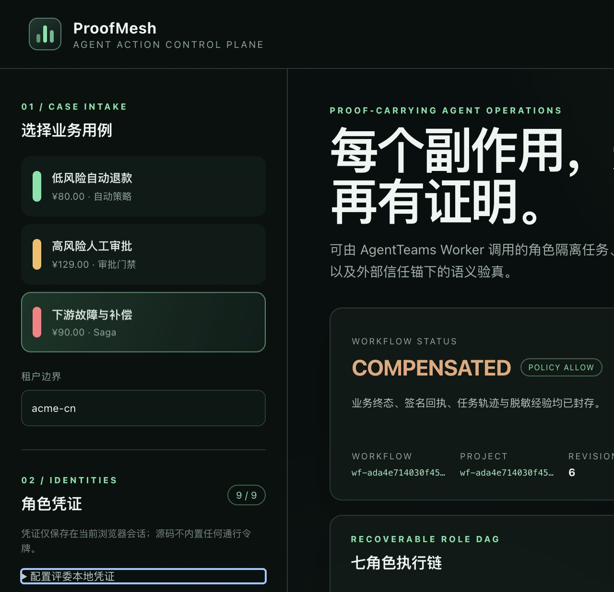

# ProofMesh — Agent Action Control Plane

> 模型可以提出退款，但不能直接拿到付款按钮。

一笔 90 元退款已经在支付侧成功，CRM 关单却失败。如果 Agent 把报错当成“没有执行”再次重试，客户可能收到两笔退款。

ProofMesh 位于 AgentTeams 与支付、CRM 等写工具之间：

- **Action Passport** 冻结主体、租户、工具、参数、审批与时效；
- **Action Gateway** 在执行瞬间逐项核对，写操作不能绕过；
- **reconcile-before-retry** 先查询上游结果，查不清就停止；
- **External Verifier** 使用 Proof 包外公钥复核审批、回执与业务终态。

[只读在线演示](https://dingyucanada.github.io/ProofMesh/) · [10 分钟复现](#10-分钟复现) · [架构说明](docs/architecture.md) · [公网演示边界](docs/public-demo-boundary.md) · [安全边界](SECURITY.md)

当前已有 Team=`Active`、7/7 Worker=`Running`、direct MCP 生命周期 7/7 与 162 项测试。边界同样明确：`modelDriven=false`，没有接入真实支付/CRM 账户，也没有客户生产试点。

本地参考环境会实际改变隔离商务库：扣减可退款余额、创建退款、关闭工单，并在下游故障时执行补偿恢复。它不是生产系统，也不是返回固定答案的聊天动画。

## 一眼看懂



| 不是 | 而是 |
|---|---|
| Agent 自己说“我有权限” | 网关在执行瞬间验签并精确匹配工具、资源、参数、金额、策略与审批 |
| 审批按钮顺便执行 | 审批只转 `WAITING_APPROVAL → AUTHORIZED`，Executor 另行领取 |
| JTI 级简单去重 | logical operation 与 credential attempt 分离，owner/generation/lease/fencing |
| 崩溃后盲目重试 | 先按稳定 operation id 向上游对账；不确定进入 `UNKNOWN` |
| 写一条“rollback”日志 | 真实 Saga compensation + 新鲜业务状态回查 |
| Proof 包自带根并自证 | Verifier 使用包外 trust bundle 与钉住策略做跨证据语义核对 |

## 10 分钟复现

环境：Python 3.10+；CI 和推荐复现环境为 Python 3.11。先确认版本：

```bash
python3.11 --version
```

```bash
python3.11 -m venv .venv
source .venv/bin/activate
pip install -e '.[dev]'
make clean-runtime
pytest -q
```

运行两条无需模型/API Key 的真实业务路径：

```bash
# 低风险：自动授权 → 退款 → 关单 → 独立回查 → Proof seal
PYTHONPATH=src python3 -m proofmesh.cli --home . demo-refund TKT-LOW-001

# 下游故障：退款 → CRM 故障 → 补偿 → 余额/工单回查 → Proof seal
PYTHONPATH=src python3 -m proofmesh.cli --home . demo-refund TKT-SAGA-001
```

高风险路径必须暂停：

```bash
PYTHONPATH=src python3 -m proofmesh.cli --home . demo-refund TKT-HIGH-001
# 复制输出中的 WORKFLOW_ID
PYTHONPATH=src python3 -m proofmesh.cli --home . approval-challenge <WORKFLOW_ID> \
  --output /tmp/proofmesh-approval-challenge.json
# 将 challenge 交给独立审批服务；reference issuer 示例及私钥边界见 docs/deployment.md
PYTHONPATH=src python3 -m proofmesh.cli --home . approve <WORKFLOW_ID> \
  --approver separation-of-duties-reviewer \
  --reason '已复核冻结计划、金额、范围与补偿条件' \
  --approval-assertion-file /path/from/external-approval-service/assertion.jws
PYTHONPATH=src python3 -m proofmesh.cli --home . resume <WORKFLOW_ID>
PYTHONPATH=src python3 -m proofmesh.cli --home . verify-proof \
  artifacts/workflows/<WORKFLOW_ID>/workflow-proof.json
```

固定工单不能被重复退款。重复整场演示前停止服务并再次执行 `make clean-runtime`；公开 benchmark 不会被清除。

## 第二业务域：生产运维配置变更

除客服退款外，仓库已有可运行的运维变更 reference adapter，复用同一 `AuthorizedToolCaller → Action Passport → Action Gateway → GatewayStore → signed Receipt → external Verifier` 协议路径：低风险成功、高风险外部签名审批、健康门失败后精确恢复，以及不可对账时进入 `UNKNOWN_MANUAL` 并停止自动重派。代码、冻结证据、限制和真实平台迁移合同见 [第二业务域说明](docs/second-domain-operations.md) 与 [operations-reference](artifacts/operations-reference/report.json)。

该实现是确定性本地 reference，不是生产集群、客户数据或试点；`risk_units` 不是金额或 ROI。

## 评委控制台

API 默认 fail closed，没有角色身份就不能变更状态：

```bash
cp .env.example .env
# 将每个 replace-with-* 替换为不同随机值，然后：
set -a
source .env
set +a
PROOFMESH_HOME=. PYTHONPATH=src uvicorn proofmesh.api:app \
  --host 127.0.0.1 --port 8000 --no-server-header
```

打开 `http://127.0.0.1:8000`，在“角色凭证”中填入七个 Agent 角色、External Assertion Approver 与 Auditor 共九个 token。高风险门禁还必须粘贴外部审批服务签发的 JWS；API Bearer subject 与 assertion subject 必须一致。Workflow、Gateway、包外 Verifier 三处独立验签，控制面不持审批私钥。参考 issuer 是 synthetic 脚本边界，不冒充企业 IdP 或 MFA。



## 七角色闭环

| 阶段 | AgentTeams Worker | 角色 MCP 工具 | 关键约束 |
|---|---|---|---|
| create | `case-orchestrator` | `create_case`, `get_state` | 只创建案件/项目，不串行跑完整流程 |
| normalize | `ticket-intake` | `normalize_case` | 输入闭合、task id、revision CAS |
| context | `context-investigator` | `gather_context` | 新鲜工单/订单读取、context digest |
| policy | `risk-policy-sentinel` | `evaluate_policy` | 冻结 policy snapshot、plan、金额与版本 |
| approval | 外部 `proofmesh-approver` | REST `approve` | assertion issuer allowlist、subject/revision/challenge/action/plan/policy 绑定 |
| execute | `action-executor` | `execute_authorized` | Passport、预算、退款/关单/补偿 Saga |
| verify | `outcome-verifier` | `verify_outcome` | 重新读取余额、退款、工单 postconditions |
| memory | `case-memory-curator` | `curate_memory` | 仅已验证终态可写脱敏经验并 seal proof |

每个转换要求认证角色、租户权限、当前 `expected_revision` 与 `task_id`；状态更新、签名 task receipt 与 outbox 同事务提交。Worker 看不到原始 Action Passport，无法把它复制到另一个工具。

## Action Passport 与恢复协议

Action Passport 是 Ed25519 compact JWS，精确绑定：

```text
tenant / subject / workflow / tool / resource / scopes / arguments digest
context / policy / approval / mode / calls / amount / workflow budget / currency
issued_at / not_before / expires_at
```

网关把 `(tenant, workflow, tool, idempotency_key)` 作为逻辑操作，固化请求和授权合同；本次凭证只属于一次 attempt。过期租约接管时：

1. 新 Passport 必须完整验签且不可变合同逐项相等；
2. 先用稳定 operation id 向上游 `reconcile`；
3. 已成功则封存原结果，不重复调用；确认未发生才安全重派；
4. 结果不确定持久化为 `UNKNOWN`，禁止自动重放；
5. finalize 必须持有当前 owner/generation，旧进程不能越过 fencing。

详细设计见 [架构说明](docs/architecture.md)。

## Proof Verifier

工作流证明包含冻结请求/计划、审批、签名 task receipts、签名 gateway receipts、双哈希链、由商务上游独立 key 签名的新鲜终态快照和 bundle signature。策略签发、执行回执、任务回执、Proof seal、商务快照五类 key usage 严格分离。验证时必须显式提供证明包之外的 trust bundle 和策略：

```bash
proofmesh --home . verify-proof artifacts/workflows/<WORKFLOW_ID>/workflow-proof.json \
  --trust-bundle config/trust/action-issuers.json \
  --policy data/policies/refund_policy.json
```

Verifier 不止验签，还核对角色 DAG、revision、职责分离、tenant、policy/plan/approval、request/result digest、工具参数、金额/币种、订单版本、退款与工单关联、余额公式和 memory 状态。Proof Sealer 即使持有自己的合法密钥，也不能伪造由另一个受信 key 签发的商务快照。整包换根重签或“签名都对但业务拼错”都会失败。

三条评委参考路径可从空白隔离运行时重新执行并导出：

```bash
make reference-evidence
```

[参考证据清单](artifacts/reference/manifest.json)包含低风险自动完成、高风险“先暂停且零副作用、审批后完成”、下游故障后补偿三条路径。每个最终 Proof 都使用另行导出的公钥信任包与钉住策略再次验真；目录不含私钥、token、数据库或运行缓存。这些是确定性商务靶场证据，不是模型质量或生产可用性指标。

独立进程 HTTP 合成盲测可用一条命令重放：

```bash
make synthetic-http-shadow
```

它冻结 240 条确定性合成案例，让支付和 CRM 在两个独立本地进程、两个独立数据库中运行，并注入关单失败、提交后超时和对账 UNKNOWN。报告与 SHA-256 清单见 [synthetic-http-shadow](artifacts/synthetic-http-shadow/report.md)；这不是企业历史数据、客户试点、第三方支付接入、人工审批断言覆盖或生产 SLA。

## Stripe / HubSpot sandbox-ready 边界

`StripeHubSpotSandboxBackend` 在同一个 `ActionGateway` 下实现 Stripe test-mode Refund 与 HubSpot developer test-account Ticket 合同：稳定 operation id / provider idempotency、提交后超时先对账、精确 tenant/workflow/resource/amount 回绑、错误分类、UNKNOWN fail-closed、live Stripe key 拒绝与 secret 零日志。仓库内只使用本地 HTTP provider 仿真器验证合同，**不声称真实账户已实跑**。

```bash
make vendor-readiness PYTHON=python3.11
pytest -q tests/test_vendor_sandbox.py
```

配置字段、HubSpot 自定义属性、最小权限与真实 test-account 取证流程见 [供应商边界](docs/vendor-sandbox-boundary.md)。密钥只放未跟踪 `.env` / secret manager，永远不要放进聊天、截图、Git 或 evidence artifact。

## AgentDojo 629 case 授权合同回放

仓库固定 AgentDojo 0.1.35 / benchmark v1 的 97 个 user tasks、27 个 injection goals、629 个组合。输入 artifact SHA-256：

```text
20146525d139f83d732bc47e0286b0eccdf67118cdc5eba84f5f079863f5546b
```

运行：

```bash
make validate-agentdojo
make replay-agentdojo
```

| 指标 | 结果 |
|---|---:|
| 合法 user ground-truth calls | 2,159 / 2,159 接受 |
| 同键缓存回放 | 2,159 / 2,159；副作用重复 0 |
| 参数/工具/上下文错配错误通过 | 各 0 / 2,159 |
| 未注册调用错误通过 | 0 / 629 |
| 一次性 Passport 换键复用拒绝 | 2,159 / 2,159 |
| Receipt 外部验签 / chain | 各 2,159 / 2,159 |
| 首次合法执行本机 p50 / p95 / p99 | 1.132 / 2.429 / 4.789 ms |

完整结果与 Wilson 95% 区间见 [authorization-contract-replay.md](artifacts/public-benchmark/authorization-contract-replay.md)。这是**授权合同工程回归**，不运行模型，不代表 AgentDojo ASR、task utility、提示注入检测率或端到端 Agent 能力。

## AgentTeams 与 Skills

`agentteams/` 锁定官方 AgentTeams `v1.2.0-beta.1` / commit `78d0ced...` 作为**已实跑可复现基线**；当前官方 stable `v1.2.2` 是迁移目标，尚未在 ProofMesh 上验证，不能写成已兼容。官网五项要求的完整映射、调用方式、Agent / Skill / MCP / RAG 关系与升级门禁见 [AgentTeams 官方要求映射](docs/agentteams-official-mapping.md)。

| 官网要求 | AgentTeams 原生落点 | 本项目证据与边界 |
|---|---|---|
| 角色编排 | Human / Worker / Team CR；`workerMembers` + `admin` | Team 以 1 Leader + 6 Worker 编排，admin 引用 1 Human；Team Active、7/7 Running |
| 任务拆解 | TeamHarness projectflow / taskflow、DAG / Task | `refund-dag.yaml`；direct create / plan / delegate 已通过 |
| 上下文传递 | Project / Task / result、Shared Storage / Matrix | ID + trace + 前驱 digest；Matrix 文件发布 `ATB-007` 仍开放 |
| 协同执行 | TeamHarness MCP；外部 Human Gate 映射 paused/resume | 跨 Leader / Worker direct lifecycle 7/7；`modelDriven=false` |
| 状态追踪 | Team / Project / node / Task / result 状态 | AgentTeams 协同账本与 ProofMesh 业务 CAS 双账关联 |

## 公开数据评测：补输入证据，不冒充客户试点

公开数据用于补足“真实语言输入能否进入安全分流”的证据层；它不提供订单、金额、授权、支付或 CRM 终态，因此不会被直接转成退款执行请求。

| 数据与范围 | 实跑结果 | 能证明 | 不能证明 |
|---|---|---|---|
| Banking77 official test 3,080 条、77 intents | accuracy 81.79%、macro-F1 81.82%；退款检测 recall 85.00%；无审批敏感旁路 80/80 拒绝、upstream dispatch=0 | 公开有标签英语意图上的透明 baseline 与保守安全分流 | 生产就绪、中文效果、真实退款或客户收益；质量门槛未全过，结论为 `NOT_PRODUCTION_READY` |
| CFPB 公开投诉 240 条，四产品各 60 | 240/240 内存摄取并分到人工复核；原文/身份字段落盘 0，写工具调用 0 | 真实公开、未验证 narrative 的隐私最小化 no-write shadow 输入适配 | accuracy、授权正确性、统计代表性或企业试点 |

复现与完整边界见 [公开数据评测说明](docs/public-dataset-benchmark.md)、[Banking77 报告](artifacts/public-domain-evaluation/banking77/report.md)和 [CFPB 报告](artifacts/public-domain-evaluation/cfpb/report.md)。第三方原始文本不进入 Apache-2.0 发布包；发布包只含来源锁、归属、摘要与聚合结果。

交付包含：

- 1 Human manifest、7 个 `qwenpaw` Worker manifests、1 Team manifest（当前 runtime Team=`Active`，`modelDriven=false`）；
- 7 个官方 ZIP 根目录结构：`manifest.json`、`config/AGENTS.md`、`config/SOUL.md`、`skills/...`；
- 退款 DAG、状态映射、角色 MCP、两阶段 `hiclaw` bootstrap；
- 严格 validator：拒绝宿主 `file://`、错误 ZIP 根、错误工具/字段/状态/错误码；
- 7 个 Skill 的 closed JSON Schema、调用条件、失败策略、安全边界、证据和错误码。

```bash
make package-agentteams
make validate-agentteams
pytest -q tests/test_agentteams.py
```

静态校验、官方控制面资源、TeamHarness 健康/MCP 调用、direct project/task 生命周期与模型驱动自主协同是不同证据级别。当前已实测 Manager/Controller、Human、7/7 Worker、7/7 TeamHarness health；最小兼容补丁已让七成员 Team 进入 `Active`，并跨 Leader / ticket-intake 两个真实容器完成 `create_project → plan_dag → delegate_task → ack_task → submit_task → check_task → accept_task_result`。这些调用是 direct MCP 控制面取证，placeholder provider 下仍不声明模型自主协同。原始去敏证据和边界见 [agentteams/README.md](agentteams/README.md) 及 `agentteams/runtime-evidence/`。

## Kubernetes 与容器边界

- 容器 UID/GID 10001、只读根文件系统、capabilities 全移除、`no-new-privileges`；
- API Bearer RBAC + tenant scope；原始 `/mcp` 只允许内部 gateway 身份；
- Admission 检查 containers/initContainers/ephemeralContainers，要求 active policy digest 精确白名单、非空安全设置和生产 image digest；
- `failurePolicy: Fail`、管理员 namespaceSelector、Agent egress 默认拒绝；
- NetworkPolicy 不是身份，受保护上游仍必须只接受 gateway mTLS/SPIFFE 身份。

部署与生产差距见 [部署文档](docs/deployment.md) 和 [安全策略](SECURITY.md)。

## 设计与复现文档

- [AgentTeams 官方能力映射](docs/agentteams-official-mapping.md)：角色编排、任务拆解、上下文传递、协同执行与状态追踪逐项落到 AgentTeams 对象；
- [Agent Identity 清单](docs/agent-identity-register.md)：逐角色列出 Name、Role、Capabilities、Inputs、Outputs、Dependencies、Decision Boundary 与 Trace；
- [七个 Skill 合同](skills/)：每个 Skill 都包含输入输出、调用条件、依赖、失败、安全边界和可复用接口；
- [阿里云 SLS Skill 采用边界](docs/aliyun-skill-adoption.md)：只读查询与最小 RAM 权限已经设计，尚未安装或云端实跑；
- [架构](docs/architecture.md)、[部署](docs/deployment.md)、[安全](SECURITY.md)与[公开 Demo 边界](docs/public-demo-boundary.md)。

AgentDojo 原始导出只在需要重生成 `cases.jsonl` 时依赖 `agentdojo==0.1.35`。发布包内的完整性校验不导入 AgentDojo，可直接运行 `make validate-agentdojo`；若要重导出，先在独立环境安装锁定版本，再运行 `make export-agentdojo AGENTDOJO_PYTHON=/path/to/python`。Makefile 不依赖开发者机器上的 `../../work` 路径。

## 项目结构

```text
src/proofmesh/
  api.py                  REST、角色 MCP、内部 MCP、health/readiness
  workflow.py             七角色 CAS 状态机、审批、outbox、Proof seal
  gateway.py              Action Passport、logical operation、lease/reconcile
  capabilities.py         canonical JWS、key usage、外部 trust verifier
  business.py             事务商务靶场与真实 Saga compensation
  workflow_verifier.py    签名 + chain + 跨证据业务语义验真
  admission.py            Kubernetes fail-closed admission
  static/                 实际调用 v1 API 的评委控制台
agentteams/                Human/Workers/Team、DAG、ZIP、bootstrap、运行证据
skills/                    七个可复用 Skill 与 schema/错误码
artifacts/public-benchmark AgentDojo cases、JSON/Markdown 回放报告
artifacts/reference        三条真实执行路径、外部验真报告与哈希清单
deploy/kubernetes/         webhook 与 NetworkPolicy 参考边界
tests/                     业务、并发、崩溃、权限、证明、AgentTeams、benchmark
docs/                      架构、部署、评测、答辩和提交材料
```

## 诚实边界

- SQLite 靶场执行真实事务，但不是生产支付/CRM；
- 开发仍可使用文件型 Ed25519；生产强制 mTLS 远程签名代理，控制面不持有私钥；
- SQLite store 不是 HA 数据库；
- AgentDojo 回放不是模型安全率；
- 成功执行有签名 receipt；拒绝当前是 SQLite audit row，不是签名拒绝回执；
- 官方 AgentTeams 资源运行不等于模型自主协同；
- 尚无第三方渗透测试、生产历史盲测或真实商业 KPI。

这些限制不会被 PPT 隐藏。当前已实现 OIDC/JWKS 验证、KMS/HSM 签名代理协议、PostgreSQL Gateway 原子账本、CycloneDX SBOM 与 SLSA/GitHub attestation 流水线；仍需真实企业 IdP/KMS/PostgreSQL 环境、其余状态 HA 迁移、真实上游、WORM/透明日志、故障演练和独立安全评估。

## 开源

核心代码采用 Apache-2.0。第三方来源和许可见 [THIRD_PARTY_NOTICES.md](THIRD_PARTY_NOTICES.md) 与 `data/benchmarks/THIRD_PARTY_AGENTDOJO.md`。贡献说明见 [CONTRIBUTING.md](CONTRIBUTING.md)。
