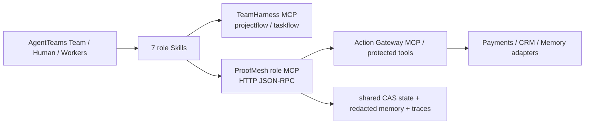

# AgentTeams 官方要求映射与兼容边界

> 审计基准：2026-08-14。赛题要求以 [GOAI Agent Infra 官方赛道页](https://www.goaihz.com/tracks?track=infra)为准；框架版本以 [AgentTeams 官方发布页](https://github.com/agentscope-ai/AgentTeams/releases)为准。

## 1. 结论先行

ProofMesh **实际使用 AgentTeams（原 HiClaw）作为多 Agent 协同设计与运行基点**，不是只在架构图中引用名称。已运行、可复现的锁定基线是：

| 项目 | 锁定值 | 证据级别 |
|---|---|---|
| AgentTeams | `v1.2.0-beta.1` | 已实跑 |
| 上游 commit | `78d0ceda336befa6e62bf89fc1a6b08b965e128d` | 已锁定 |
| API / 资源 | `agentteams.io/v1beta1` 的 Human、Worker、Team | 已应用 |
| Worker runtime | `qwenpaw`；本地兼容镜像 `v1.2.0-beta.1-compat2` | 已实跑 |
| TeamHarness | projectflow / taskflow MCP；项目内部锁标识 `builtin-v1beta1` | 已直接调用 |
| `agent-client-protocol` | `0.10.1` | beta 兼容层已验证 |
| 当前官方 stable | `v1.2.2` | **迁移目标，尚未在 ProofMesh 上验证** |

因此，本文所有“已验证”结论只适用于上述点版本、commit 与兼容层，不把 `v1.2.2` 或其他未来版本写成兼容范围。升级必须通过第 6 节门禁后才能修改宣传口径。

## 2. 官网五项能力逐条映射

| 官网要求 | AgentTeams 原生对象 / 能力 | ProofMesh 设计映射 | 可核验证据 | 当前边界 |
|---|---|---|---|---|
| 角色编排 | Manager、Human、Worker、Team CR；`spec.workerMembers` 与 `admin` | 1 个 Human、1 个 Team、7 个具备不同职责和唯一角色 MCP 的 qwenpaw Worker；Leader 与 6 Worker 显式分离 | [`team.yaml`](../agentteams/team.yaml)、[`human.yaml`](../agentteams/human.yaml)、[`workers.yaml`](../agentteams/workers.yaml)、[`control-plane.json`](../agentteams/runtime-evidence/control-plane.json) | Team=`Active`、Human=`Active`、7/7 Worker=`Running` 已证；这不等于模型自主协作 |
| 任务拆解 | TeamHarness `projectflow` / `taskflow`；Project、DAG plan、Task | Leader 创建 Project、规划退款 DAG，再把 normalize、context、policy、execute、verify、memory 六个节点物化为角色任务；审批门前不得委派 execute | [`refund-dag.yaml`](../agentteams/refund-dag.yaml)、[`teamharness-direct.json`](../agentteams/runtime-evidence/teamharness-direct.json) | direct 证据跑通一个 Leader→ticket-intake 任务的七步生命周期；完整七节点由静态合同与本地业务闭环证明，不冒充七 Worker 模型驱动实跑 |
| 上下文传递 | TeamHarness Project / Task 元数据、result、Shared Storage 与 Matrix 消息面 | 每次跨角色交接携带 `workflow_id`、`task_id`、`trace_id` 和前驱输出 digest；Project plan、Task meta、result 分别封存摘要；业务敏感上下文仍由 ProofMesh 角色 MCP 按租户和角色读取 | [`refund-dag.yaml`](../agentteams/refund-dag.yaml)、[`teamharness-direct.json`](../agentteams/runtime-evidence/teamharness-direct.json)、[`architecture.md`](architecture.md) | Project / Task / result 同步及摘要已证；可选 Matrix 文件面板发布因 `ATB-007` 未验证，不作为上下文成功证据 |
| 协同执行 | TeamHarness MCP：创建、规划、委派、认领、提交、检查、验收；Human / Matrix 协作面 | `case-orchestrator` 与各专业 Worker 通过官方 TeamHarness 状态流协作；业务动作通过角色 MCP 进入 ProofMesh；高风险执行由外部 Human assertion 暂停/恢复 | [`teamharness-direct.json`](../agentteams/runtime-evidence/teamharness-direct.json)、[`agentteams/README.md`](../agentteams/README.md) | 跨真实 Leader / Worker 容器的 `create_project → plan_dag → delegate_task → ack_task → submit_task → check_task → accept_task_result` 为 7/7 direct MCP 取证；`modelDriven=false` |
| 状态追踪 | Team、Project、DAG node、Task meta、Task result 状态；TeamHarness 持久化 | AgentTeams 协同账本跟踪 `planned / assigned / in_progress / submitted / completed`；ProofMesh 业务 CAS 账本独立跟踪授权、执行、补偿与验证，两账通过 ID 和 digest 关联 | [`refund-dag.yaml`](../agentteams/refund-dag.yaml)、[`control-plane.json`](../agentteams/runtime-evidence/control-plane.json)、[`teamharness-direct.json`](../agentteams/runtime-evidence/teamharness-direct.json) | Team Active、Task 状态同步、Leader 拉取并验收已证；业务状态不由 Matrix 消息替代，两个账本不混写 |

这五项映射同时满足“框架能力”和“项目证据”两层核验：AgentTeams 负责角色与协同状态，ProofMesh 负责高风险业务动作的授权、恢复和独立证明。

## 3. 版本、调用方式与接口边界

| 层 | 版本 / 兼容范围 | 调用方式 | 失败与替换边界 |
|---|---|---|---|
| AgentTeams 控制面 | 仅声明已验证 `v1.2.0-beta.1` / `78d0ced...` | `hiclaw apply -f` 应用 Human / Worker / Team；`hiclaw get ... -o json` 做去敏状态核验；[`bootstrap.sh`](../agentteams/bootstrap.sh) 分 prepare/team 两阶段执行 | beta REST 对 `workerMembers` 的缺口使用 commit/hash 锁定的最小 Controller 兼容补丁；不是上游发布 |
| AgentTeams Worker | qwenpaw `v1.2.0-beta.1-compat2`；ACP `0.10.1` | AgentTeams 装载每角色 ZIP，在 Worker 中启动 runtime 与 TeamHarness；gateway consumer key 投射到角色 MCP 的 `Authorization` header | 每个 key 必须换发为唯一角色和 tenant scope；不得进入 YAML、ZIP、日志或证据包 |
| TeamHarness | `builtin-v1beta1` | Leader / Worker 容器内的 stdio MCP；projectflow / taskflow 工具完成七步生命周期 | direct MCP 验证与模型驱动验证分级；Matrix artifact publication 不计入已通过生命周期 |
| ProofMesh | 项目 `1.0.0`；Python `3.10+` | Worker 以 HTTP MCP JSON-RPC `initialize`、`tools/list`、`tools/call` 调用唯一角色端点；Action Gateway 再调用受保护工具 | 角色 MCP 是协同到业务控制面的窄接口；支付、CRM、KMS、IdP 与数据库均可由 adapter 替换 |

## 4. Agent、Skill、MCP、RAG 的关系

- **Agent**：AgentTeams Worker 是运行与身份单元；Team 和 Human 负责 roster、Leader/Worker 关系及人工治理。Agent 只看到其角色允许的高层工具。
- **Skill**：Skill 是可版本化的能力合同，定义输入/输出、调用条件、依赖工具、失败策略、安全边界和证据。七个 Skill 分别装入七个 Worker ZIP；Skill 不持有底层 Action Passport 签名材料。
- **MCP**：TeamHarness MCP 是协同连接层，负责 Project / Task 生命周期；ProofMesh 角色 MCP 是业务能力连接层；内部 Action Gateway MCP 是副作用授权与执行层。Skill 调用 MCP，但不能绕过网关直连支付或 CRM。
- **RAG**：本项目明确**不使用 RAG**，避免为满足名词而引入无必要检索层。按照赛题允许的替代路径，已实现共享 CAS 状态、脱敏终态记忆和 Trace / receipt 可观测三项能力；原始工单与支付数据按需通过角色 MCP 读取，不写入通用向量库。

## 5. 为什么选 AgentTeams，以及什么可以替换

选择 AgentTeams 首先是赛题强制要求，其次是它的原生 Human / Worker / Team 资源、TeamHarness Project / Task 状态流、Matrix 协作面和 MCP / Skill 接口与本项目“角色职责分离 + 可审计交接”一致。ProofMesh 没有在 AgentTeams 外另造一个同名编排器来规避框架。

ProofMesh 把 **AgentTeams 作为协作平面**。产品化时可替换模型 provider、Worker runtime、对象存储、Matrix 展示面以及支付/CRM/记忆后端；替换必须保留稳定 Project/Task ID、显式 DAG 与前驱 digest、角色身份、可暂停的 Human gate、幂等任务状态、结果摘要和审计 trace。ProofMesh 的 Action Passport、Gateway 与 Proof Verifier 不依赖某个模型厂商，但仍通过适配层与 AgentTeams 协同账本关联。

## 6. `v1.2.2` 迁移门禁与成本

`v1.2.2` 是当前官方 stable，也是下一迁移目标；**尚未实跑，不能直接宣称兼容**。升级分支必须全部通过以下门禁：

1. 锁定官方 tag、commit、镜像 digest 与许可证，检查 CRD、CLI、TeamHarness、Worker runtime 和包结构差异；
2. 用未修改的 `v1.2.2` Manager / Controller 优先重放 Human、7 Worker、Team，确认能移除 beta `workerMembers` REST 补丁；
3. 验证 7/7 Worker Running、Team Active、7/7 TeamHarness health、角色 MCP 鉴权投射与最小权限；
4. 重放同一 `create → plan → delegate → ack → submit → check → accept` 生命周期，并逐项比较 Project / Task / result 摘要；
5. 回归审批暂停/恢复、失败/补偿、双账关联、密钥零泄漏和降级路径；
6. 单独复验 `ATB-007`。只有 Matrix artifact publication 成功，才把它从开放发现移除；
7. 真实模型协同仍是另一门禁。即使上述控制面全部通过，只要没有模型驱动原始记录，仍保持 `modelDriven=false`。

迁移成本是**工程估算，不是已发生工时**：若 `v1.2.2` 保持现有 CRD、包和 TeamHarness 合同，预计 4–8 人日（差异审计 1–2、适配与清理 2–4、全量取证 1–2）；若存在状态/包格式迁移或 TeamHarness 破坏性变化，预计 8–15 人日。回滚方式是保留当前 commit、镜像 digest、兼容补丁与去敏证据，在新版本未过门禁前继续把 `v1.2.0-beta.1` 作为可复现基线。

## 7. 不能越过的证据边界

- `modelDriven=false`：Manager 使用 deliberate placeholder provider，`welcomeSent=false`；七步调用由运行容器内 TeamHarness MCP 直接触发，只证明控制面生命周期。
- `ATB-007`：Task 状态和 result 已同步，Leader 也完成检查与验收；可选 Matrix artifact publication 因 workspace `shared` 符号链接路径校验失败，仍为 open，未计入 7/7 成功。
- 本地最小 Controller 补丁使 beta Team Active，但它不是官方 `v1.2.2`，也不证明补丁已被上游合并。
- Team Active、7/7 health、direct lifecycle、完整七角色模型协同是四种不同证据，提交材料不得互相替代。

去敏原始摘要见 [`agentteams/runtime-evidence/`](../agentteams/runtime-evidence/README.md)；兼容发现见 [`compatibility-findings.json`](../agentteams/runtime-evidence/compatibility-findings.json)。
