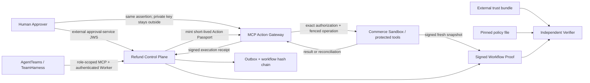
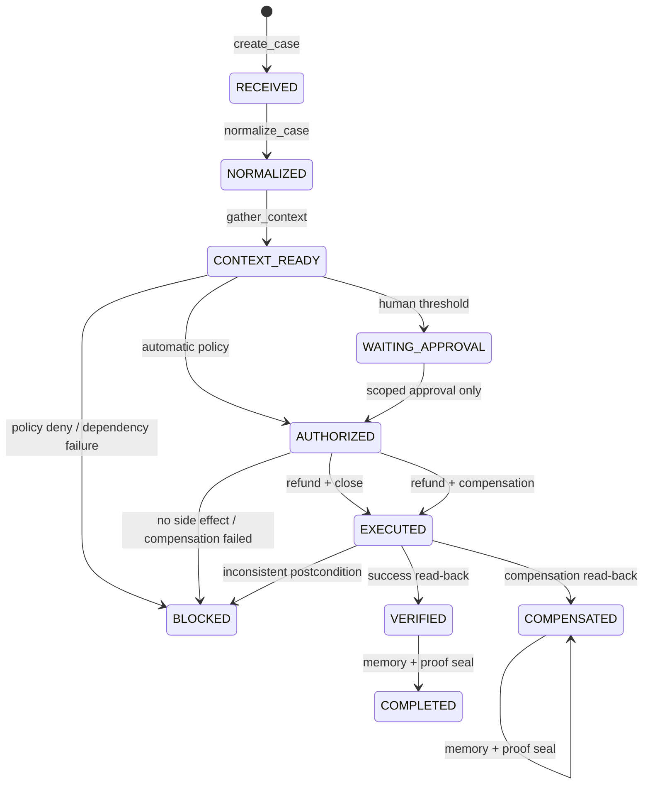
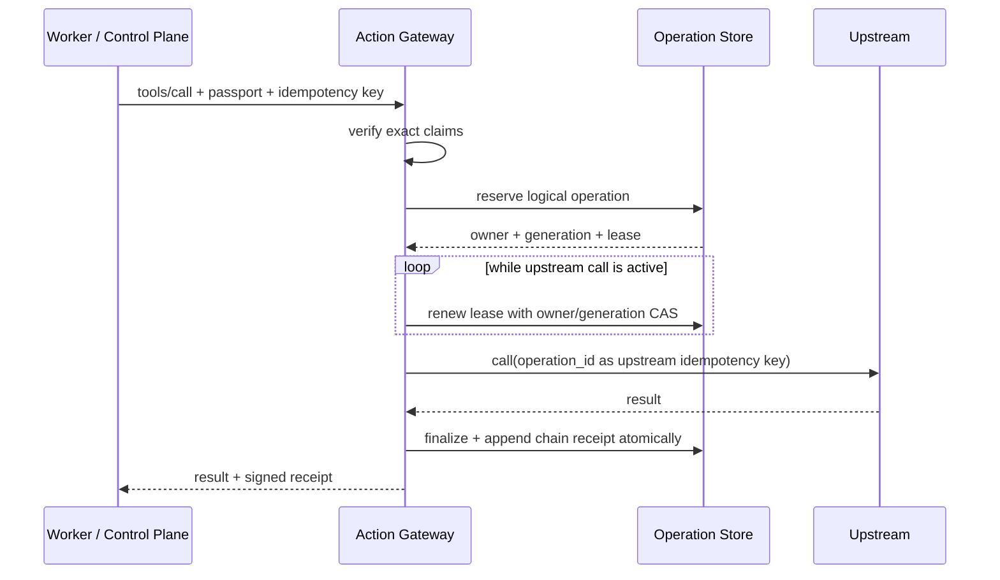

# ProofMesh 1.0 架构说明

## 1. 目标

ProofMesh 不负责让模型“更聪明”，而负责让多 Agent 的业务动作在生产语义下满足四件事：

- **执行前可授权**：这一次调用的主体、工具、资源、参数、金额、预算、策略和审批均被冻结；
- **执行中不漂移**：授权在 MCP 网关执行瞬间重新验证，Worker 不能修改或看到底层许可证；
- **失败后可恢复**：重试以逻辑操作而不是本次 token 为中心，崩溃后先对账，再决定回放或进入未知态；
- **执行后可证明**：独立 Verifier 使用系统之外的信任锚复算签名、链，并验证由商务上游独立身份签名的业务终态。

退款参考用例是一条本地 Saga。SQLite 商务靶场会真实执行余额扣减、退款记录、工单关闭和补偿恢复，因此能验证事务与故障恢复；它不连接真实企业账户。

## 2. 控制面与数据面



控制面负责角色状态机、冻结策略/计划、审批、签发 Action Passport、收集回执和封存证明。数据面只负责 MCP 工具发现、执行时授权、逻辑操作去重、预算、派发、对账与签名执行回执。两者通过窄接口连接，原始 Passport 不会返回给 Worker 或前端。

## 3. 七角色可恢复 DAG

| 顺序 | 认证角色 | AgentTeams Worker | 唯一高层工具 | 产物 |
|---|---|---|---|---|
| 1 | `orchestrator` | `case-orchestrator` | `create_case`, `get_state` | project/workflow、初始 task receipt |
| 2 | `intake` | `ticket-intake` | `normalize_case` | 规范化案件 |
| 3 | `investigator` | `context-investigator` | `gather_context` | 工单与订单快照、context digest |
| 4 | `policy` | `risk-policy-sentinel` | `evaluate_policy` | risk、冻结 plan、policy decision |
| 5 | 外部 Human | 不属于 Worker | `approve` REST | digest-bound approval；无副作用 |
| 6 | `executor` | `action-executor` | `execute_authorized` | 退款、关单或补偿回执 |
| 7 | `verifier` | `outcome-verifier` | `verify_outcome` | 新鲜业务回查与 postconditions |
| 8 | `memory` | `case-memory-curator` | `curate_memory` | 脱敏经验与 sealed proof |

每个状态转换都要求调用者的 Bearer 身份具备唯一角色和租户权限，并提交 `expected_revision` 与 `task_id`。数据库使用 status/revision CAS；并发或过期 Worker 只能得到冲突，不能重复推进。转换、签名 task receipt 和 outbox 行在同一事务中提交，outbox 再以稳定 event id 幂等写入哈希链。



`COMPENSATED` 在 verifier 回查后仍可能有 `next_step=curate_memory`；只有 Memory Worker 封存后 `next_step` 才为空。消费者不能只按状态名判断项目已关闭。

## 4. Action Passport

Action Passport 是紧凑 Ed25519 JWS，关键 claims 包括：

```text
issuer / subject / tenant_id / workflow_id / jti
tool / resource / scopes / arguments_digest / context_digest
policy_digest / plan_digest / approval_digest / mode
max_calls / max_amount_minor / budget_limit_minor / currency
issued_at / not_before / expires_at
```

网关不接受“工具类型相近”或“金额不超过即可”的宽松匹配：工具、资源和规范化参数摘要必须精确相等。`issuer + token_type` 受外部 trust bundle 的 key usage 约束，时间窗、撤销和 key 有效期也在执行时检查。

## 5. 逻辑操作、尝试与崩溃恢复

仅以 JTI 做幂等会产生两个相反问题：旧 token 过期后无法恢复，或新 token 造成二次副作用。ProofMesh 将两层分开：

- **logical operation**：唯一键为 `(tenant, workflow, tool, idempotency_key)`，固化 request digest 与除 JTI/时间外的完整授权合同；
- **attempt**：记录本次 issuer/JTI、owner UUID、fencing generation 与续租；
- **capability usage**：按 `(issuer, jti)` 统计调用与金额；
- **workflow budget**：按 `(tenant, workflow, currency)` 累计，不能靠更换 Agent subject 绕过。



进程在派发前后崩溃时，新等价 Passport 只能在不可变合同完全一致时接管。租约过期后先调用上游 `reconcile(operation_id)`：

- `SUCCEEDED`：封存对账结果，不再次派发；
- `NOT_FOUND`：用同一稳定 operation id 重新派发；
- `UNKNOWN` 或对账异常：持久化 `UNKNOWN` 并停止自动重试，等待人工处置。

finalize 必须持有当前 owner/generation；旧进程即使恢复也无法提交结果。相同幂等键的成功重放返回同一结果和 receipt，不增加预算、不产生第二个链项。

## 6. 业务 Saga 与不变量

商务靶场不是返回固定 JSON 的 mock。它使用 WAL SQLite 和真实事务维护 customers、orders、tickets、refunds 与 memory：

- 退款记录和订单可退款余额在同一事务中变更；
- 金额必须等于已审查工单请求金额，订单必须可退款且 version 与冻结计划一致；
- 退款 A 不能关闭工单 B；同一 workflow 不能使用不同不可变参数；
- CRM 关单失败而退款已发出时，使用单独授权的 `payments.compensate_refund` 恢复余额并重开工单；
- Verifier 重新读取退款、订单和工单，成功路径要求余额准确减少、工单由同一 workflow 关闭；补偿路径要求余额恢复、退款为 `COMPENSATED`、工单开放。

## 7. 双链与独立验真

工作流证明 `proofmesh-workflow-proof/v2` 包含冻结请求、策略与计划摘要、Human approval、task receipts、gateway receipts、事件、商务上游 snapshot attestation、最终业务快照和 bundle signature。策略、Gateway、Workflow、Proof Sealer、Commerce 各有单一用途签名 key；Verifier 的信任输入不来自证明包本身：

```bash
proofmesh --home . verify-proof artifacts/workflows/<id>/workflow-proof.json \
  --trust-bundle config/trust/action-issuers.json \
  --policy data/policies/refund_policy.json
```

Verifier 会失败关闭地检查：

1. proof bundle 签名、每个 task/gateway receipt 的签名与 token type；
2. 外部策略文件内容和 digest；
3. task role、DAG 顺序、revision、actor 数量与职责分离；
4. 外部 approval assertion 的 issuer allowlist、subject、revision、challenge、两项具体 action、scope、plan / policy / context / workflow / tenant 与时间绑定；
5. receipt chain、request/result digest、subject 与 operation 绑定；
6. 工具参数与冻结 plan 的业务语义；
7. Commerce 身份、snapshot digest、workflow/tenant 与新鲜业务快照绑定；
8. 金额、币种、余额、refund/ticket/order 的跨证据终态；
9. memory 封存状态。

因此“整包换根、重签、重算哈希”仍会被外部信任锚拒绝；Proof Sealer 也不能替 Commerce 重签快照；“签名都有效但把工单、金额或 scope 拼错”会被语义一致性检查拒绝。参考实现的 Commerce 是隔离靶场，生产必须把该 attestation 接口替换为真实上游或可信审计代理。

## 8. 部署边界

- REST 与角色 MCP 使用 Bearer RBAC + tenant scope；内部原始 `/mcp` 只允许 gateway 身份。
- Kubernetes Admission 校验所有 containers、initContainers 和 ephemeralContainers，要求精确 active policy digest、非空安全配置和生产镜像 digest。
- NetworkPolicy 默认拒绝 Agent egress，只允许 DNS 与 gateway；保护工具只允许 gateway Pod ingress。
- 生产上游仍必须用 mTLS/SPIFFE 认证 gateway，不能把 Kubernetes label 当成密码。

更完整的威胁模型见 `SECURITY.md`，部署步骤见 `docs/deployment.md`，公开基准见 `docs/evaluation.md`。
